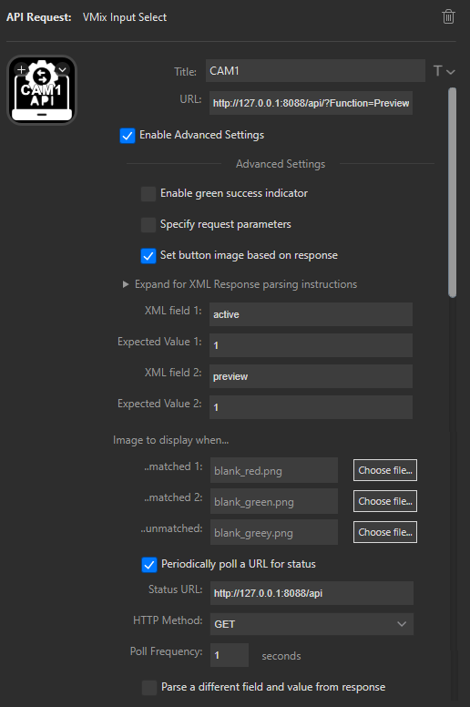
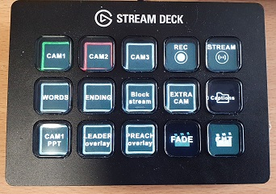

# StreamDeck VMix API Input Plugin

A Plugin for the Elgato Stream Deck for selecting VMix inputs using API requests and reading back VMix status to give feedback using the button icon.

This allows you to create StreamDeck buttons which operate like a production switcher to select VMix inputs and show Red (Program), Green (Preview), or Grey (unselected).

Based on https://github.com/mjbnz/streamdeck-api-request

## Installing the plugin

* Go to the Streamdeck plugins folder at `C:\Users\%USERNAME%\AppData\Roaming\Elgato\StreamDeck\Plugins\`
* Create a folder for this plugin called `com.github.congoblue\streamdeck-vmix-input-api.sdPlugin`
* Copy the contents of the `\sources` folder into this new folder
* Shut down the Streamdeck software and restart it
* The VMix Input API Request plugin should now be listed in the Streamdeck software.

## Set plugin options to control VMix

For this example we will create a button which controls Input 1 on VMix.



* Drag the "API Input Request" plugin onto one of the buttons in the Streamdeck software.
* Set the title to give the Streamdeck button caption (in this example, `CAM1`). Use the [T] menu next to the Title to position the caption and set the font.
* Set the URL option to `http://127.0.0.1:8088/api/Function=PreviewInput&Input=1` (replace the `Input=` parameter with desired input number. You can also use the input name on VMix but use `%20` for spaces)
* Tick the [Enable Advanced Settings] box.
* Tick the [Set Button Image based on response] box.
* Set [XML Field 1] to `active` (the input number of the program output)
* Set [Expected Value 1] to the input number (in this example `1`).
* Set [XML Field 2] to `preview` (the input number of the program output)
* Set [Expected Value 2] to the input number (in this example `1`).
* Set [Image to display when matched 1] to the Program state icon. In this case we will use `blank_red.png` from the images folder. 
* Set [Image to display when matched 2] to the Preview state icon. In this case we will use `blank_green.png` from the images folder.
* Set [Image to display when unmatched] to the unselected state icon. In this case we will use `blank_grey.png` from the images folder.
* Tick the [Periodically poll a URL for status] box.
* Set [Status URL] to `http://127.0.0.1:8088/api`
* Set [Poll Frequency] to `1 second`.

If you have VMix running, the Streamdeck button should now show a red, green or grey border depending on whether the input is selected for program out, or preview, or unselected. Pressing the button (or using the VMix UI) should change the state.

Copy and paste this button to create other input buttons with the same settings.



> If VMix is not running the button will show a yellow exclamation.

### If the button icon does not change state

> No button icon must be set in the Streamdeck App. If you've allocated a button icon yourself then the API cannot change it. Click on the "Down" arrow on the button image and select "Reset to Default". The icon set by the API should then show up.

## Notes on creating a plugin for Streamdeck

Getting started with Stream Deck.

The fastest way to get started with Stream Deck is using the plugin template.
1.  Stream Deck Plugin Template
    * Checkout the plugin template from 
 `git clone https://github.com/elgatosf/streamdeck-plugin-template`

2. Refactor the Unique Identifier
   * Rename the folder `com.elgato.template.sdPlugin` using i.e. `com.example-url.plugin-name.sdPlugin`. Replace any reference to `com.elgato.template` in the manifest.json and app.js.
3. Javascript Libraries
   * The Javascript SDK communicates with the Stream Deck websocket and listens for events. Clone this library into the plugin folder or add it as a git submodule.
   * Clone
`git clone https://github.com/elgatosf/streamdeck-javascript-sdk src/my.domain.plugin-name/libs`

   * Add Submodule
`git submodule add https://github.com/elgatosf/streamdeck-javascript-sdk src/my.domain.plugin-name/libs`
4. Add the Plugin to Stream Deck
   * Create a symbolic link of the plugin's folder inside of the Stream Decks Plugins folder.
   * Windows SymLink
(Note: this works inside the cmd, not on PowerShell.
 %cd% gets the full absolute path to the plugin folder)
`mklink /D C:\Users\%USERNAME%\AppData\Roaming\Elgato\StreamDeck\Plugins\com.example.my-plugin.sdPlugin %cd%\src\com.example.my-plugin.sdPlugin`
   * macOS SymLink
(Using \$(pwd) to get the full absolute path to the plugin folder)
`ln -s $(pwd)/src/com.example.my-plugin.sdPlugin ~/Library/Application\ Support/com.elgato.StreamDeck/Plugins/`
5. Debugging
   * Set the `html_remote_debugging_enabled` flag and restart Stream Deck. A list of plugins available for debugging are now available from a browser at `http://localhost:23654/`. Refresh the plugin or property inspector at any time by reloading its page (Changes to the manifest.json will still require restarting Stream Deck).
   * With debugging enable, you can also debug the property inspector (user interface) of your plugins. 

   * macOS Debugging:
`defaults write com.elgato.StreamDeck html_remote_debugging_enabled -bool YES`
   * Windows Debugging: 
On Windows, add a DWORD `html_remote_debugging_enabled` with value 1 in the registry `@HKEY_CURRENT_USER\Software\Elgato Systems GmbH\StreamDeck`.

6. Build the Plugin
*  Everything is now configured to build a Stream Deck plugin!


## Typical VMix XML status response

Send `http://127.0.0.1:8088/api`

```
  <vmix>
  <version>23.0.0.57</version>
  <edition>Basic</edition>
  <inputs>
  <input key="695b6d65-3548-47f9-9a08-bcddf967265e" number="1" type="Blank" title="Blank" shortTitle="Blank" state="Paused" position="0" duration="0" loop="False">Blank</input>
  <input key="bb198a82-d7a0-463e-b4c0-c97187b784cc" number="2" type="Blank" title="Blank" shortTitle="Blank" state="Paused" position="0" duration="0" loop="False">Blank</input>
  </inputs>
  <overlays>
  <overlay number="1"/>
  <overlay number="2"/>
  <overlay number="3"/>
  <overlay number="4"/>
  <overlay number="5"/>
  <overlay number="6"/>
  </overlays>
  <preview>2</preview>
  <active>1</active>
  <fadeToBlack>False</fadeToBlack>
  <transitions>
  <transition number="1" effect="Fade" duration="500"/>
  <transition number="2" effect="Merge" duration="1000"/>
  <transition number="3" effect="Wipe" duration="1000"/>
  <transition number="4" effect="CubeZoom" duration="1000"/>
  </transitions>
  <recording>False</recording>
  <external>False</external>
  <streaming>False</streaming>
  <playList>False</playList>
  <multiCorder>False</multiCorder>
  <fullscreen>False</fullscreen>
  <audio>
  <master volume="100" muted="False" meterF1="0" meterF2="0" headphonesVolume="100"/>
  </audio>
  </vmix>
```  